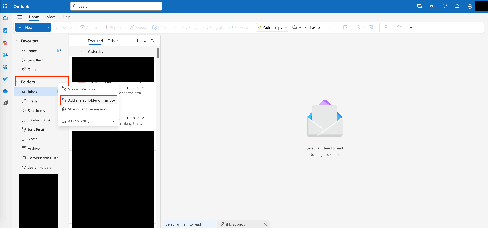
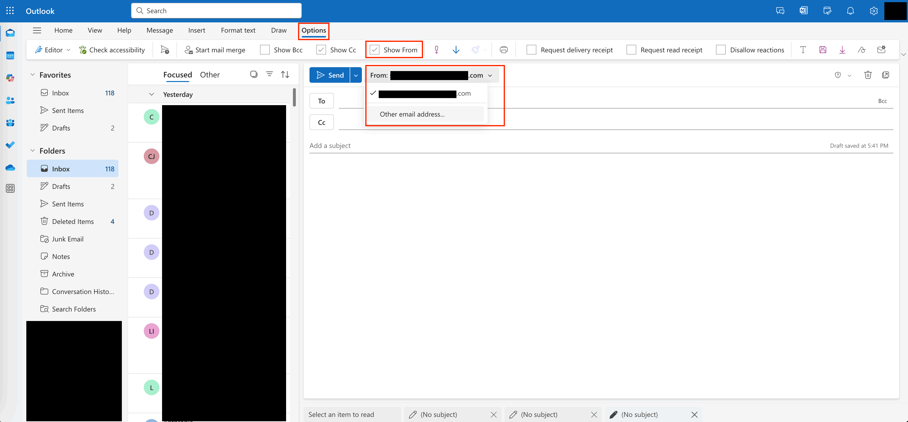

Manage Users
==============================================================================
这篇文档主要讲作为管理员如何管理 Office 下的 User. 在这一节中我们将会介绍如何:

- 如何创建用户
- 如何给予用户适当的权限
- 如何让一个指定另一个用户作为管理员来协助你管理其他的用户
- 以及如何通过 Team 和 Group 来批量管理用户

Sign In
------------------------------------------------------------------------------
首先要确保你是 `Global Admin <https://learn.microsoft.com/en-us/microsoft-365/admin/add-users/about-admin-roles?view=o365-worldwide>`_, 也就是这个 Microsoft 365 Plan 的 Owner, 你负责付款, 以及你对这个账号下的所有东西有最终所有权.

然后你就要用你的 email 和 password login. 本质上你也是一个 User, 只不过你有 Global Admin 的权限.

1. Go to https://www.office.com/, click "Sign in" button on the top right.

.. image:: ./office-login-1.png

2. Click the Admin button to enter the Admin Management page (https://admin.microsoft.com/Adminportal/Home#/homepage).

.. image:: ./office-login-2.png

Manage Users
------------------------------------------------------------------------------
要管理公司员工的 User Account, 例如为新雇员创建 User, 可以点击左侧的 Users -> Active Users 菜单. 在这一菜单下你可以看到公司所有的员工列表, 以及 Add User 的按钮. 你还可以选中一个 User 对它进行管理.

.. image:: ./manage-users-1.png

当公司有雇员时, 可以用 Add User 按钮来创建一个新用户. 创建的过程有三部:

1. 填名字等基本信息.
2. Product License, 决定了这个用户能用哪些产品.
3. Role, 决定了这个用户在 Microsoft 365 公司中的管理员权限. 这个权限定义了这个用户能在 Microsoft 365 中对进行哪些管理类型的操作, 这个权限跟能不能访问 OneDrive, Word, Excel, PPT 没有关系. 下面一节我们会详细讲这个 Role 的概念.

Manage Roles
------------------------------------------------------------------------------
由于老板的精力是有限的, 一般需要让一个雇员而不是老板本人来协助管理 Office 365 中的 User. 这种需求可以由 Admin Roles 功能实现.

我们来看一个 User Detail Info 的例子. 我们选中 SA 这个 User, 可以看到他的详细信息. 里面有这个 User 的 Roles 信息.

.. image:: ./manage-users-2.png

点开之后就能看到这个用户的 Roles. 每个 Roles 的详细解释可以在 `Commonly used Microsoft 365 admin center roles <https://learn.microsoft.com/en-us/microsoft-365/admin/add-users/about-admin-roles?view=o365-worldwide#commonly-used-microsoft-365-admin-center-roles>`_ 文档中找到. 根据名字可以直观的看到 User Administrator 有管理 Users 的权限, Teams Administrator 有管理 Teams 和 Groups 的权限 (Teams 和 Groups 的概念我们之后会说).

.. image:: ./manage-users-3.png

Guest User
------------------------------------------------------------------------------
当需要与外部人员进行合作时 (如临时合作人员或服务供应商), 我们可以将他们作为 Guest User 邀请到组织中. Guest User 可以通过自己的邮箱访问特定的协作功能, 例如在 Microsoft Teams 中与内部员工进行沟通, 接收内部员工的邮件, 以及共享特定文件等. 需要注意的是, Guest User 的访问权限是受限的, 他们无法访问公司内部普通用户的 SharePoint 站点或共享的 OneDrive 文件夹. 通常的做法是, 在邀请 Guest User 加入组织后, 为其创建专门的 Microsoft Teams. 在这个特定的 Teams 空间内, Guest User 可以获得对应的 OneDrive 子文件夹访问权限, 并能与被添加到同一 Teams 中的内部成员进行协作. 这种方式既能确保外部人员与内部员工进行必要的协作, 又可以有效控制其访问权限. 

注:

- Guest User 不会产生任何费用.
- Guest User 不会自动获得任何 OneDrive 的访问权限. 他只能访问他所在的 Team 中的 Shared Folder (在 Microsoft Teams 中可以看到)

Reference:

- `about guest users <https://learn.microsoft.com/en-us/microsoft-365/admin/add-users/about-guest-users?view=o365-worldwide>`_

Manage Shared Mailboxes
------------------------------------------------------------------------------
在企业的使用场景中, 经常需要为公司的社交媒体账号, 市场营销 (Marketing) 或客户支持 (Customer Support) 等设置一个专门的邮箱, 用于接收邮件和注册媒体账号. 

这样做的目的是因为这类媒体账号通常应由公司的管理层拥有, 比如公司的创始人或高层管理者. 如果直接使用创始人的邮箱来创建这些账号, 那么在使用第三方服务登录时, 往往需要接收验证码或激活邮件, 这就意味着需要拥有该邮箱的访问权限. 

然而, 创始人本人不可能处理所有事务, 通常会将这类任务外包给团队中的运营人员. 如果将创始人的邮箱分享给他们, 不仅不安全, 而且创始人本人有可能会离职. 如果使用带有创始人姓名的邮箱, 一旦其离职, 邮箱的所有权转移将会非常麻烦. 

因此, 最好是创建一个公司专用的虚拟邮箱. 例如, 社交媒体用 media@company.com, 市场营销用 marketing@company.com, 信息咨询用 info@company.com, 招聘用 jobs@company.com 等. 通过这种方式, 在系统后台中只需为不同员工分配对应邮箱的使用权限. 无论员工离职与否, 公司都可以轻松地控制谁可以使用这些邮箱账号, 从而大大提高管理的便利性. 

在 Microsoft 365 中, 这项功能是自带的. 只要邮箱的使用量不超过 50GB, 就无需支付许可费用, 也就是相当于免费的功能. 一旦超过这个限制, 该邮箱就需要购买许可, 和普通员工邮箱一样使用. 只是, 这种邮箱的登录凭证可能需要被分享出去. 

不过, 这种做法应尽量避免. 因为如果需要通过账号密码来登录, 就失去了在后台进行权限管理的能力. 你必须共享用户名和密码, 这样就不安全. 因此, 总体而言, 一般不会轻易超过免费使用的限制.

这里还有一个问题. 每个 Shared Mailbox 你依然要起一个名字, 就像给一个真人用的邮箱一样. 我们拿用来注册 Linkedin 等媒体账号的邮箱为例好了. 这个名字是有可能被 Public 所看到的. 如果你起一个比如叫做 Media Shared Mail, 这样外面的人看到就会很奇怪. 所以我推荐使用 "公司名 + 职能" 的格式作为名字. 比如 MyCompany Media Team. 招聘就用 MyCompany Recruiter Team. 客服就是 MyCompany Support Team. 这样外面的人看到就不会觉得奇怪了.

创建好 Shared Mailbox 之后, 你就要进入到 Member 的界面选择谁可以使用 (读或写) 这个邮箱.

设置好了 shared mail 之后, 你就可以在 Folder 中添加这个 shared mail (只要你设置了权限). 然后就可以看到收到的邮件了.

如果你要用这个邮箱发邮件, 你需要点击 New Email 之后, 打开 Option, 打开 Show From 选项, 然后在 From 里选择用这个 Shared Mailbox 发送既可.

Reference:

- `about shared mailboxes <https://learn.microsoft.com/en-us/microsoft-365/admin/email/about-shared-mailboxes?view=o365-worldwide>`_
