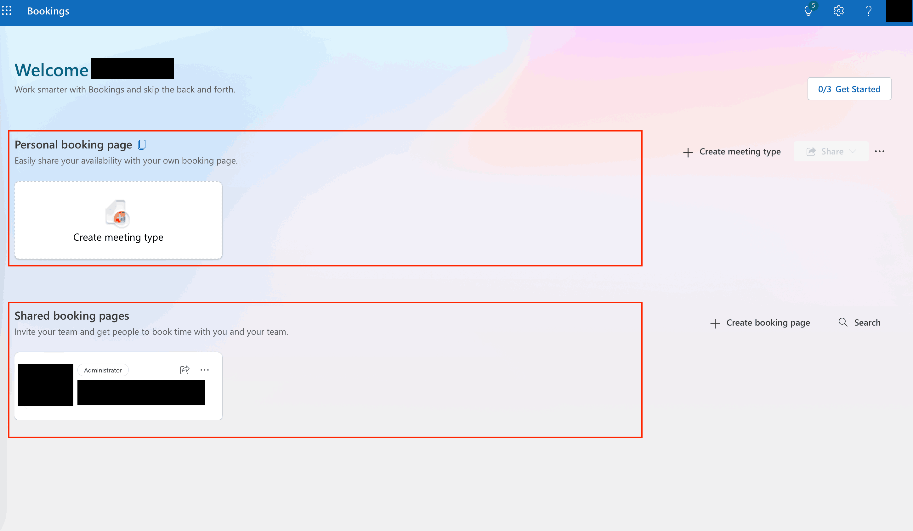
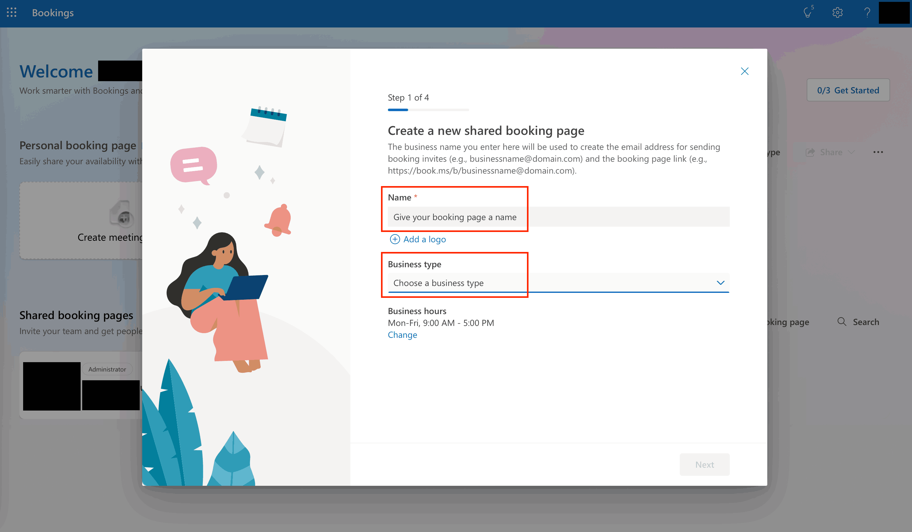
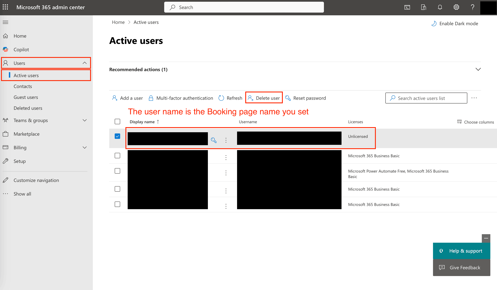
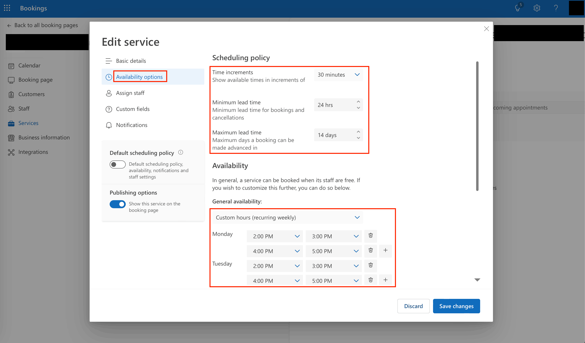

Microsoft Bookings
==============================================================================

Overview
------------------------------------------------------------------------------
谈到预约领域的软件, 就不得不提及明星软件 `Calendly <https://calendly.com/>`_, 大量的创业者, 自媒体从业者, 咨询公司都使用这个软件来管理预约.

但很多人不知道的是, Microsoft Office 365 企业邮箱的用户自带一个叫 `Microsoft Bookings <https://learn.microsoft.com/en-us/microsoft-365/bookings/bookings-overview>`_ 服务, 完全包含在基础套餐里面, 无需额外付费. 但是功能上和 Calendly 相比, 在严肃的商业预约场景是丝毫不差的.

本文就来探索一下 Microsoft Bookings 的使用场景, 以及如何创建和管理预约页面.

Booking Page Business Logic
------------------------------------------------------------------------------
首先我们来了解一下 In general, Booking Page 是一个什么东西.

简单来说就是你创建一个日历, 在日历上创建一些时间窗口, 比如每半小时为一个窗口, 每天开两个这样的窗口. 然后别人可以在这个系统中看到哪些窗口仍然是开放的, 就可以跟你预约. 这就跟你一般去政府部门办事预约的流程是一样的.

这样的好处是能够让接待预约的人能够灵活的把自己的 availability 分享给他人, 并且让系统管理哪些时间是已经被预约的, 哪些时间是空闲的.

Personal Booking Page vs Shared Booking Page
------------------------------------------------------------------------------
你进入 Bookings 的页面就会看到两个大大区域: Personal Booking Page 和 Shared Booking Page.

- Personal Booking Page: 简单来说就是你个人的预约页面, 别人只能跟你约. 这个主要适合于你作为个人品牌跟别人约.
- Shared Booking Page: 这个是一个共享的预约页面, 这个共享指的是你们团队内部的共享, 也就是说可以让整个团队, 或者派其中的一个人去进行接待. 这个适合于一个企业作为一个品牌跟别人约.

既然用 Microsoft Office 365 的一般都是企业用户, 那么我们就来重点说一下怎么用 Shared Booking Page 来做生意.

Creating a Shared Booking Page
------------------------------------------------------------------------------
点击 Create Shared Booking Page 按钮, 然后选择一个合适的模板, 这里我们选择的是 ``Start from Scratch`` (也就是没有模板).

这里是第一个注意点, booking page 的名字就决定了你最后用来 booking 的 URL 链接, 同时也决定了这个 booking page 背后由 Microsoft 来管理的一个邮箱地址 (相当于是一个虚拟人). 虽然名字之后可以改, 但是 URL 和邮箱地址是不能改的, 所以最开始创建的时候就想好. 我建议这个名字跟想要跟你预约的人所感兴趣的事相关. 比如这是一个咨询服务, 那么就把这个咨询服务的名字作为名字比较好.

Delete a Shared Booking Page
------------------------------------------------------------------------------
由于 Shared Booking Page 的影响范围包括所有参与过的客户以及团队成员, 所以删除一个 Shared Booking Page 是一个非常严肃的操作. 系统不允许个人直接删除 Shared Booking Page, 哪怕是创建者本人也不可以. 只能由 Microsoft Office 365 的 Admin 来删除.

由于 Shared Booking Page 的背后是一个由 Microsoft 来管理的特殊邮箱, 预约信息会先进入这个邮箱, 然后系统有系列规则将这些信息转发给团队成员 (这就是这个功能的底层实现), 所以你删除这个对应的邮箱 (在系统里以一个虚拟的 User 存在), 就相当于删除了这个 Shared Booking Page. 这也是为什么只有 Admin 才能删除的原因. 具体的操作界面如下:

Manage Service and Availability
------------------------------------------------------------------------------
一般你让别人来跟你约肯定有一个主题. 在企业场景下这个主题一般就是一个 Service (服务). 虽然说一个 Booking Page 可以关联多个 Service, 然后用户进入这个 Booking Page 之后可以选择自己想要的 Service, 但是为了简化用户体验, 我们建议每个 Booking Page 只关联一个 Service.

而你在 Service 里创建好你的 Service 之后, 里面有很多设置. 这里比较关键的是 **Availability Option**. 在下图你可以看到界面里有几个比较重要的地方:

- Minimum Lead Time: 就是预约至少需要提前多少时间. 太短你没有时间准备.
- Maximum Lead Time: 就是预约最多提前多少时间. 太长用户约了以后很容易忘记.
- Availability: 这里就是每天你的预约窗口期, 这个肯定要比 Service 里面设置的预约时间的 Duration 要长.

另外还有两个概念这里也说一下. 在 Service 主界面有一个 Buffer time, 简单来说就是预约前你需要空出多少时间准备, 之后要留出多少时间收尾. 没有 Buffer 就很可能会出现 Back to Back 的情况, 万一客户需要多一点时间, 就会影响到下一个客户.

至于后面还有 Custom Field 我们就不展开了, 这个是给用户在预约的时候填写一些额外的信息, 比如你可以让用户填写他们的需求, 这样你在接待的时候比较容易有的放矢.

Reference
------------------------------------------------------------------------------
- `官方文档主页 <https://learn.microsoft.com/en-us/microsoft-365/bookings/bookings-overview?view=o365-worldwide>`_
